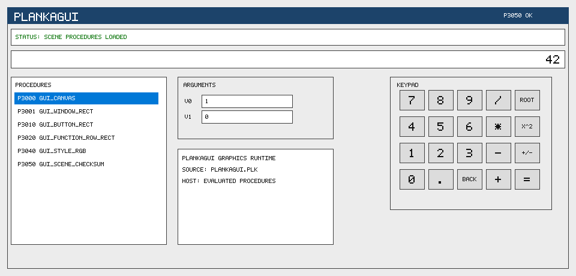

<p align="center">
  
</p>

# PlankaC: Kompakte Plankalkuel-Laufzeit in C

[English README](README.en.md) | Lizenz: MIT

PlankaC ist ein kleiner Parser, Interpreter, Bytecode-Schreiber,
Bytecode-Runner, C-Backend-Emitter, native ASM-Backend und Einbettungs-API
fuer eine lineare Plankalkuel-Notation. PlankaMath ist das mitgelieferte
Beispielprojekt: ein Taschenrechner mit weiteren `.plk`-Plaenen fuer
indizierte Werte, geschachtelte Felder, Listen, Paare, Mengen, Relationen,
komplexe Werte, 3D-Vektoren, 4x4-Matrizen, Projektion, Schleifen,
Assertions und Schachstrukturen.

## Inhalt

| Pfad | Zweck |
| --- | --- |
| `src/` | `.plk`-Plaene in linearer Plankalkuel-Notation |
| `examples/` | kleine Beispielsitzungen |
| `tests/` | Selbsttests als `.plk`-Programme |
| `c/` | PlankaC-Module, klassische C-Laufzeit, Konsolenstarter, DOS-Runner, Win32/Win64-GUI und Win16-GUI |
| `graphics/` | PlankaGUI: grafische Oberflaechen aus `.plk`-Prozeduren |
| `asm/` | 8086-Hilfsroutine |
| `docs/` | Syntax, Ausfuehrungsmodell, Infografik, Quellenbasis, Bibliographie |

Wichtige Dateien:

| Datei | Zweck |
| --- | --- |
| `src/01_arithmetic.plk` | Grundrechenarten |
| `src/02_order.plk` | Vergleiche, Minimum, Maximum |
| `src/03_scientific.plk` | Quadrat, Potenz, Wurzel, Prozentrechnung |
| `src/04_calculator.plk` | Rechnerablaeufe |
| `src/05_memory.plk` | Speicherfunktionen |
| `src/06_data_structures.plk` | indizierte Werte, Felder, Listen, Schleifen, Assertions |
| `src/07_chess.plk` | einfache Schach-Praedikate als Strukturbeispiele |
| `src/08_relations_sets.plk` | geschachtelte Records, Paare, Mengen und Schachrelationen |
| `src/09_complex.plk` | komplexe Werte mit `[:C32.16]` Markern |
| `src/10_relation_algebra.plk` | Mengen-Differenz, Teilmengen, Relationsprojektionen |
| `src/11_structured_values.plk` | handle-basierte Records und geschachtelte Werte |
| `src/12_relation_composition.plk` | kartesische Produkte, Relationskomposition, einfache Quantoren |
| `src/13_chess_board.plk` | Brett-, Figuren- und Angriffskarten-Beispiele |
| `src/14_two_dimensional_tables.plk` | ausfuehrbare zweidimensionale Tabellenzeilen |
| `src/15_3d_geometry.plk` | moderne 3D-Erweiterung mit `vec3`, `mat4`, Transformation und Projektion |
| `src/16_value_algebra.plk` | Listen-, Mengen-, Paar-, Record- und Relationsgleichheit |
| `src/17_chess_model.plk` | Brettzustand, Figurenwerte, Angriffskarten und Check-Beispiele |
| `src/18_two_dimensional_general.plk` | frei ausgerichtete und vertauschte `V|`/`S|` Tabellenzeilen |
| `c/include/plankac.h` | PlankaC-API fuer C-Programme und die Windows-GUI |
| `c/core/` | Parser, Interpreter, Source-Loader und API-Implementierung |
| `c/types/` | Strukturmarker, Typfamilien und Kompatibilitaetsregeln |
| `c/notation/` | zweidimensionale Plankalkuel-Tabellenzeilen |
| `c/analyzer/` | statische Programmpruefungen ueber Prozedurgrenzen |
| `c/backends/` | Bytecode, C-Backend, x86-64-ASM und 8086/DOS-ASM |
| `c/targets/` | CLI-, DOS-, Win16- und Windows-GUI-Hosts |
| `c/legacy/plankamath.c` | kompakte Rueckfall-Laufzeit |
| `graphics/src/plankagui.plk` | Fenster-, Button-, Listen- und Farb-Prozeduren fuer grafische Ausgabe |
| `graphics/c/` | modulare PlankaGUI-Lade-, Raster-, Schrift-, Export- und Render-Schicht |
| `build-dos.bat` | Open-Watcom-Build fuer `build\dos\PMDOS.EXE` |
| `build-win16.bat` | Open-Watcom-Build fuer `build\win16\PlankaMath16.exe` |
| `examples/c_api_demo.c` | kleines externes C-Programm mit PlankaC als Bibliothek |
| `tests/plankac_conformance.c` | Conformance-Runner fuer Parser und Laufzeit |

Siehe auch `docs/infographic.md` fuer eine kurze visuelle Projektkarte.

## PlankaGUI

PlankaGUI beschreibt ein kompaktes Rechnerfenster in `.plk`: Canvas,
Fensterrahmen, Statuszeile, Anzeige, Prozedurliste, Argumentfelder,
Tastenraster und Farbpalette kommen aus ausfuehrbaren PlankaC-Prozeduren. Der
C-Code ist in kleine Module fuer Laden, Rasterung, Schrift, Export und
Szenenaufbau getrennt. Die PNG-Datei ist nur das Referenzbild fuer README und
Tests; die Oberflaeche selbst wird durch Plankalkuel-Prozeduren beschrieben.
`build\PlankaGUI.exe` oeffnet die Szene als Windows-Fenster.
Das Fenster ist klickbar und skaliert die gerenderte Szene bei Groessenaenderung
mit festem Seitenverhaeltnis. Tastendruecke werden ueber die in `.plk`
definierten Button-Rechtecke erkannt; Rechenoperationen laufen ueber PlankaC-
Prozeduren wie `add`, `multiply`, `divide_checked`, `square` und
`root_checked`.

<p align="center">
  
</p>

## Beispiel

Eine einfache Addition in der Projekt-Notation:

```text
P10 add (V0[:32.16], V1[:32.16]) => R0[:32.16]
(V0[:32.16] + V1[:32.16]) => R0[:32.16]
END
```

Die klassische PlankaMath-C-Schicht verwendet dazu eine passende Funktion:

```text
P10 add             => pm_add
P14 divide_checked  => pm_divide_checked
P52 root_checked    => pm_root_checked
P999 all_tests      => pm_all_tests
```

Der zentrale Pfad ist PlankaC: die Module lesen die `.plk`-Dateien, bauen eine
Prozedurtabelle und fuehren das `.plk`-Profil des Projekts direkt aus.
Unterstuetzt sind Zuweisungen, Guards, arithmetische Ausdruecke, indizierte
Werte, Felder, Listen, Mengen, Relationen, komplexe Werte, 3D-Vektoren,
4x4-Matrizen, Projektion, Schleifen, Assertions, Prozeduraufrufe und mehrere
Rueckgabewerte, etwa bei
`divide_checked`.

PlankaC kann ausserdem eine lesbare Bytecode-Datei erzeugen, wieder laden und
ausfuehren. Fuer C- und native x86-64-ASM-Builds koennen daraus kleine
generierte Runner entstehen:

```text
build\plankac.exe bytecode build\plankamath.pbc
build\plankac.exe checkbc build\plankamath.pbc
build\plankac.exe runbc build\plankamath.pbc set_session
build\plankac.exe cgen build\plankac_generated.c
build\plankac.exe asmgen build\plankac_asm_runtime.S
build\plankac.exe asm8086 build\plankac_8086.asm
```

Mehr dazu steht in `docs/execution_model.md`.

Die 3D-Schicht ist bewusst als moderne PlankaC-Erweiterung markiert. Sie
erweitert das implementierte Sprachprofil um Vektoren, Matrizen,
Transformationen und Projektion, ohne diese Erweiterung dem dokumentierten
Plankalkuel-Sprachkern zuzuschreiben.

## Voraussetzungen

Auf Windows brauchst du:

```text
PowerShell oder cmd
einen C-Compiler im PATH
```

GCC oder MinGW reicht fuer die aktuelle Konsolen- und Windows-Version. Open
Watcom ist interessant fuer Win16- und DOS-Ziele.

## Bauen

PowerShell oeffnen:

```powershell
cd C:\Users\Admin\Downloads\PlankaMath
New-Item -ItemType Directory -Force build
```

Einfacher Build:

```powershell
.\build.bat
```

Manueller Build der wichtigsten PlankaC-Objekte:

```powershell
gcc -Wall -Wextra -std=c89 -Ic\include -Ic\internal -c c\core\plankac_common.c -o build\plankac_common.o
gcc -Wall -Wextra -std=c89 -Ic\include -Ic\internal -c c\core\plankac_source.c -o build\plankac_source.o
gcc -Wall -Wextra -std=c89 -Ic\include -Ic\internal -c c\core\plankac_expr.c -o build\plankac_expr.o
gcc -Wall -Wextra -std=c89 -Ic\include -Ic\internal -c c\types\plankac_types.c -o build\plankac_types.o
gcc -Wall -Wextra -std=c89 -Ic\include -Ic\internal -c c\notation\plankac_2d.c -o build\plankac_2d.o
gcc -Wall -Wextra -std=c89 -Ic\include -Ic\internal -c c\analyzer\plankac_analyzer.c -o build\plankac_analyzer.o
gcc -Wall -Wextra -std=c89 -Ic\include -Ic\internal -c c\backends\plankac_bytecode.c -o build\plankac_bytecode.o
gcc -Wall -Wextra -std=c89 -Ic\include -Ic\internal -c c\backends\plankac_asm8086.c -o build\plankac_asm8086.o
gcc -Wall -Wextra -std=c89 -Ic\include -Ic\internal -c c\core\plankac_runtime.c -o build\plankac_runtime.o
gcc -Wall -Wextra -std=c89 -Ic\include -Ic\internal -c c\backends\plankac_native_runtime.c -o build\plankac_native_runtime.o
ar rcs build\libplankac.a build\plankac_common.o build\plankac_source.o build\plankac_expr.o build\plankac_types.o build\plankac_2d.o build\plankac_analyzer.o build\plankac_bytecode.o build\plankac_asm8086.o build\plankac_runtime.o build\plankac_native_runtime.o
gcc -Wall -Wextra -std=c89 -Ic\include examples\c_api_demo.c build\libplankac.a -o build\plankac_api_demo.exe -lm
gcc -Wall -Wextra -std=c89 -Ic\include tests\plankac_conformance.c build\libplankac.a -o build\plankac_conformance.exe -lm
```

Windows-GUI bauen:

```powershell
gcc -mwindows build\plankac_common.o build\plankac_types.o build\plankac_2d.o build\plankac_analyzer.o build\plankac_source.o build\plankac_expr.o build\plankac_bytecode.o build\plankac_asm8086.o build\plankac_runtime.o build\plankamath.o build\windows_gui.o -o build\PlankaMath.exe -lm
```

Echtes Win16-GUI fuer Windows 3.x bauen:

```bat
build-win16.bat
```

Dafuer wird Open Watcom 1.9 oder Open Watcom V2 benoetigt. Der Build erzeugt
`build\win16\PlankaMath16.exe`, ein 16-bit-Windows-Programm im NE-Format.
Zielplattform sind Windows 3.x und kompatible Win16-Umgebungen. Die Win16-
Ausgabe verwendet die kompakte PlankaMath-C-Laufzeit; Parser, Bytecode,
C-Backend und ASM-Backend bleiben Teil der modernen PlankaC-Toolchain.

Echten 16-bit-DOS-Runner bauen:

```bat
build-dos.bat
```

Der Build erzeugt `build\dos\PMDOS.EXE`. Der kurze 8.3-Dateiname ist Absicht:
er funktioniert auch in klassischen DOS-Umgebungen ohne lange Dateinamen.

Wenn `gcc` nicht gefunden wird, muss ein C-Compiler separat installiert oder
entpackt werden. Danach muss dessen `bin`-Ordner im `PATH` stehen.

## Starten

Quelltextzaehlung und Prozedurpruefung:

```powershell
.\build\plankamath_cli.exe compile
```

Erwartete Ausgabe:

```text
Compile OK: 14 files, 62 procedures
```

Demo ausfuehren:

```powershell
.\build\plankamath_cli.exe demo
```

Erwartete Ausgabe:

```text
30
```

Selbsttests ausfuehren:

```powershell
.\build\plankamath_cli.exe tests
```

Erwartete Ausgabe:

```text
1
```

Division-durch-null-Beispiel:

```powershell
.\build\plankamath_cli.exe guarded
```

Erwartete Ausgabe:

```text
0, 1
```

`.plk` direkt mit PlankaC ausfuehren:

```powershell
.\build\plankac.exe check
.\build\plankac.exe run calculator_demo
.\build\plankac.exe run divide_checked 84 0
.\build\plankac.exe tests
.\build\plankac.exe run three_d_pipeline_session
.\build\plankac.exe bytecode build\plankamath.pbc
.\build\plankac.exe checkbc build\plankamath.pbc
.\build\plankac.exe runbc build\plankamath.pbc set_session
.\build\plankac.exe cgen build\plankac_generated.c
.\build\plankac.exe asmgen build\plankac_asm_runtime.S
.\build\plankac.exe asm8086 build\plankac_8086.asm
```

Erwartete Ausgabe:

```text
PlankaC OK: 24 files, 116 procedures
R0=30
R0=0 R1=1
R0=1
R0=120
Bytecode written: build\plankamath.pbc
Bytecode OK: 116 procedures
R0=2
C backend written: build\plankac_generated.c
ASM runtime written: build\plankac_asm_runtime.S
8086 ASM written: build\plankac_8086.asm
R0=2
R0=0 R1=1
R0=12
R0=2
R0=1
```

GUI starten:

```powershell
.\build\PlankaMath.exe
```

Die GUI laedt die `.plk`-Plaene ueber PlankaC. Die Legacy-C-Laufzeit bleibt
als Rueckfallpfad im Build.

Win16-GUI unter Windows 3.x starten:

```text
build\win16\PlankaMath16.exe
```

64-bit Windows enthaelt kein Win16-Subsystem mehr. Fuer Tests auf aktuellen
Windows-Systemen kann die Win16-Ausgabe ueber `otvdm/winevdm` gestartet werden:

```bat
run-win16-otvdm.bat
```

Das Skript sucht `otvdm` unter `tools\otvdm`, `C:\OTVDM` und im `PATH`.

DOS-Runner starten:

```text
PMDOS demo
PMDOS tests
PMDOS run add 12 8
PMDOS run divide_checked 84 0
```

Auf einem modernen Windows-PC kann der DOS-Runner ueber DOSBox gestartet werden:

```bat
run-dos-dosbox.bat demo
run-dos-dosbox.bat run add 12 8
```

## PlankaC aus C benutzen

PlankaC kann in ein anderes C-Programm eingebettet werden:

```c
#include "plankac.h"

PLANKAC_CONTEXT *ctx;
PLANKAC_RESULT result;
double args[2];
char err[256];

ctx = plankac_create();
plankac_context_load_default(ctx, err, sizeof(err));
args[0] = 12.0;
args[1] = 8.0;
plankac_context_run(ctx, "add", args, 2, &result, err, sizeof(err));
plankac_destroy(ctx);
```

Siehe [`docs/plankac_api.md`](docs/plankac_api.md).

## Conformance

Parser- und Laufzeitkanten werden hier geprueft:

```powershell
.\build\plankac_conformance.exe
```

Siehe [`docs/conformance.md`](docs/conformance.md) und
[`docs/plankac_bytecode.md`](docs/plankac_bytecode.md). Die breitere
Sprachabdeckung steht in [`docs/plankalkuel_coverage.md`](docs/plankalkuel_coverage.md).

## Quellenbasis

PlankaC ist eine kleine Hommage an Konrad Zuses Plankalkuel. Die Notation und
die Projektstruktur orientieren sich an Zuses Plankalkuel-Arbeiten und an der
spaeteren Implementierungs- und Analyse-Literatur zum System.

Besonders wichtig sind Zuses Aufsatz von 1948, der Bericht *Der Plankalkuel*
von 1972, die Analyse von W. K. Giloi aus dem Jahr 1997 und der technische
Bericht von Rojas, Goektekin, Friedland, Krueger, Langmack und Kuniss aus dem
Jahr 2000. Der Bericht von 2000 ist fuer dieses Projekt besonders nuetzlich,
weil er Plankalkuel als implementierbare Sprache beschreibt und Beispiele in
linearer Schreibweise diskutiert.

Die vollstaendige Literaturliste steht in
[`docs/bibliography.md`](docs/bibliography.md).

Direkter Link zum technischen Bericht von 2000:

https://web.archive.org/web/20060501175521/http://www.zib.de/zuse/Inhalt/Programme/Plankalkuel/Plankalkuel-Report/techreport.pdf

Kurze Projektbezeichnung:

```text
PlankaC: Eine kleine Hommage an Konrad Zuses Plankalkuel
```

## Lizenz

MIT. Siehe `LICENSE`. Die Datei enthaelt zusaetzliche Hinweise fuer PlankaC,
PlankaMath, die `.plk`-Beispiele, die C-API, generierte Artefakte und
Quellenangaben.
