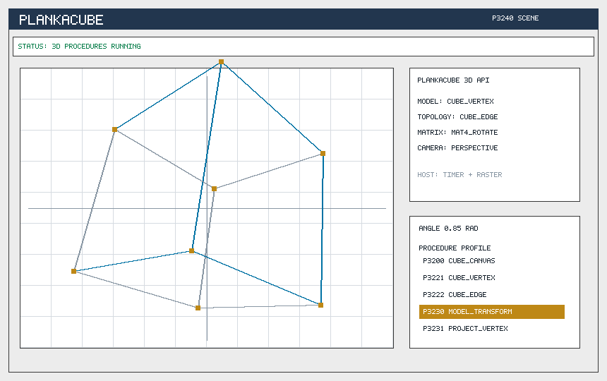

<p align="center">
  
</p>

# PlankaC: Kompakte Plankalkuel-Laufzeit in C

[English README](README.en.md) | Lizenz: MIT

PlankaC ist ein kompakter Parser, Interpreter, Bytecode-Schreiber,
Bytecode-Runner, C-Backend-Emitter, native ASM-Backend und Einbettungs-API
fuer eine lineare Plankalkuel-Notation. PlankaMath ist das mitgelieferte
Beispielprojekt: ein Taschenrechner mit weiteren `.plk`-Plaenen fuer
indizierte Werte, geschachtelte Felder, Listen, Paare, Mengen, Relationen,
komplexe Werte, 3D-Vektoren, 4x4-Matrizen, Rotation, Projektion, Schleifen,
Assertions und Schachstrukturen.

## Inhalt

| Pfad | Zweck |
| --- | --- |
| `src/` | `.plk`-Plaene in linearer Plankalkuel-Notation |
| `examples/` | fokussierte Beispielsitzungen |
| `tests/` | Selbsttests als `.plk`-Programme |
| `c/` | PlankaC-Module, klassische C-Laufzeit, Konsolenstarter, DOS-Runner, Win32/Win64-GUI und Win16-GUI |
| `graphics/` | PlankaGUI: grafische Oberflaechen aus `.plk`-Prozeduren |
| `asm/` | 8086-Hilfsroutine |
| `docs/` | Sprachreferenz, Standardbibliothek, Compiler-Handbuch, Beispiele, Portierung, Ausfuehrungsmodell |

Wichtige Dateien:

| Datei | Zweck |
| --- | --- |
| `src/01_arithmetic.plk` | Grundrechenarten |
| `src/02_order.plk` | Vergleiche, Minimum, Maximum |
| `src/03_scientific.plk` | Quadrat, Potenz, Wurzel, Prozentrechnung |
| `src/04_calculator.plk` | Rechnerablaeufe |
| `src/05_memory.plk` | Speicherfunktionen |
| `src/06_data_structures.plk` | indizierte Werte, Felder, Listen, Schleifen, Assertions |
| `src/07_chess.plk` | Schach-Praedikate als Strukturbeispiele |
| `src/08_relations_sets.plk` | geschachtelte Records, Paare, Mengen und Schachrelationen |
| `src/09_complex.plk` | komplexe Werte mit `[:C32.16]` Markern |
| `src/10_relation_algebra.plk` | Mengen-Differenz, Teilmengen, Relationsprojektionen |
| `src/11_structured_values.plk` | handle-basierte Records und geschachtelte Werte |
| `src/12_relation_composition.plk` | kartesische Produkte, Relationskomposition, einfache Quantoren |
| `src/13_chess_board.plk` | Brett-, Figuren- und Angriffskarten-Beispiele |
| `src/14_two_dimensional_tables.plk` | ausfuehrbare zweidimensionale Tabellenzeilen |
| `src/15_3d_geometry.plk` | moderne 3D-Erweiterung mit `vec3`, `mat4`, Rotation, Transformation und Projektion |
| `src/16_value_algebra.plk` | Listen-, Mengen-, Paar-, Record- und Relationsgleichheit |
| `src/17_chess_model.plk` | Brettzustand, Figurenwerte, Angriffskarten und Check-Beispiele |
| `src/18_two_dimensional_general.plk` | frei ausgerichtete und vertauschte `V|`/`S|` Tabellenzeilen |
| `src/19_language_closure.plk` | C-Bank, mehrdimensionale Indizes, Bit-/Fixed-Werte, Contracts, Listen-/Relationsauswahl und Brettzuege |
| `src/20_page_table.plk` | Page-/Table-Notation, Praedikat-Syntax, bit-native Wertpruefungen, legale Zuege, Materialsuche und Matt-Sitzung |
| `src/21_chess_game.plk` | Partie-naehere Schachprozeduren: Legal-Move-Count, Rochadepfad, Promotion und Positionssignatur |
| `src/22_predicate_schema.plk` | Relationsauswahl, Relationsquantoren und deterministische Schemasignaturen |
| `src/23_chess_complete.plk` | En-passant-Pruefung, Patt, FEN-nahe Signatur und Zuglisten |
| `c/include/plankac.h` | PlankaC-API fuer C-Programme und die Windows-GUI |
| `c/core/` | Parser, Interpreter, Source-Loader und API-Implementierung |
| `c/types/` | Strukturmarker, Typfamilien und Kompatibilitaetsregeln |
| `c/notation/` | zweidimensionale Plankalkuel-Tabellenzeilen, Document-Validation und Page-/Table-Expansion |
| `c/analyzer/` | statische Programmpruefungen, Interprocedural Checks und Structural Schema Inference |
| `c/values/` | Bit-Packing, tagged PLC values und Fixed-Point-Helfer auf Raw Values |
| `c/ir/` | typed IR fuer Compiler- und Backend-Grenzen |
| `c/models/` | Brettbasierte Schachlegalitaet, Legal-Move-Count, Rochadepfad, Promotion, En passant, Patt, Signaturen, Material, Capture Search und Mattpruefung |
| `c/backends/` | Bytecode, Lowering-Report, C-Backend, x86-64-ASM und 8086/DOS-ASM |
| `c/targets/` | CLI-, DOS-, Win16- und Windows-GUI-Hosts |
| `c/legacy/plankamath.c` | kompakte Rueckfall-Laufzeit |
| `graphics/src/plankagui.plk` | Fenster-, Button-, Listen- und Farb-Prozeduren fuer grafische Ausgabe |
| `graphics/src/plankacube.plk` | 3D-Szenenprofil mit Cube-Topologie, Matrix-Transform und Projektionsprozeduren |
| `graphics/c/plankahost.h` | gemeinsames Host-API fuer `.plk`-Anwendungen |
| `graphics/c/` | PlankaHost-, PlankaGUI-, PlankaCube-, Raster-, Schrift-, Export- und Render-Schicht |
| `build-dos.bat` | Open-Watcom-Build fuer `build\dos\PMDOS.EXE` |
| `build-win16.bat` | Open-Watcom-Build fuer `build\win16\PlankaMath16.exe` |
| `examples/c_api_demo.c` | kompaktes externes C-Programm mit PlankaC als Bibliothek |
| `examples/c_abi_demo.c` | bidirektionales ABI-Beispiel: C registriert eine Funktion, `.plk` ruft sie auf |
| `examples/host_abi.plk` | Quellprozedur mit Aufruf einer registrierten C-Funktion |
| `tests/plankac_conformance.c` | Conformance-Runner fuer Parser und Laufzeit |

Siehe `docs/index.md` fuer die komplette Dokumentationskarte.
Siehe `docs/architecture.md` fuer Schichten und Modulgrenzen.
Siehe auch `docs/infographic.md` fuer eine kurze visuelle Projektkarte.
Das Ausfuehrungsmodell fuer `.plk`-Anwendungen steht in
`docs/plk_application_model.md`; die Host-Schicht ist in
`docs/plankahost_api.md` beschrieben.

## Dokumentation

| Handbuch | Inhalt |
| --- | --- |
| [`Formal Specification`](docs/spec/index.md) | Grammatik, Value Model, Typregeln, Ausfuehrungsregeln, Fehlerregeln und Backend-Kontrakt |
| [`Language Reference`](docs/language_reference.md) | Quelldateien, Prozeduren, Speicherbaenke, Marker, Ausdruecke, Aufrufe, Guards, Schleifen, Assertions, indizierte Referenzen und ausfuehrbare zweidimensionale Zeilen |
| [`Standard Library`](docs/standard_library.md) | gebuendeltes `.plk`-Profil: Arithmetik, Rechnersitzungen, Datenstrukturen, Relationen, komplexe Werte, Schachstrukturen, 3D-Geometrie und Anwendungsprofile |
| [`Compiler Guide`](docs/compiler_guide.md) | `plankac.exe`-Befehle, Bytecode, generiertes C, native ASM, 8086-ASM, Build-Artefakte und Pruefbefehle |
| [`Compiler Pipeline`](docs/compiler_pipeline.md) | stabiler Pfad `.plk -> IR/Bytecode -> Lowering -> C/ASM -> native executable` |
| [`Examples`](docs/examples.md) | ausfuehrbare Quell- und Kommando-Beispiele fuer das implementierte Sprachprofil |
| [`Porting Guide`](docs/porting_guide.md) | Einbettung, Plattformziele, Win16/DOS-Grenzen, PlankaHost-Integration und Backend-Regeln |
| [`ABI And Embedding API`](docs/abi.md) | C-Hosts rufen PlankaC-Prozeduren auf; `.plk`-Quellen rufen registrierte C-Funktionen auf |

## PlankaHost

Der bevorzugte grafische Einstieg ist `PlankaHost.exe`. Der Host laedt die
Standardbibliothek aus `src/` und danach eine `.plk`-Anwendung. Die Anwendung
meldet ihren Typ ueber `app_kind` und stellt gemeinsame Prozeduren wie
`app_canvas`, `app_checksum` und `app_timer_step` bereit.

```powershell
.\build\PlankaHost.exe graphics\src\plankagui.plk
.\build\PlankaHost.exe graphics\src\plankacube.plk
```

`PlankaGUI.exe` und `PlankaCube.exe` bleiben als direkte Kompatibilitaets-
Starter vorhanden, aber die gemeinsame Host-API ist `PlankaHost`.

Fuer eingebettete Programme ist `graphics/c/plankahost.h` der praktische
Einstieg. `plankahost_open` laedt die komplette PlankaC-Basis, die alten
Rechnerprozeduren, Datenstruktur-, Relations-, Schach- und 3D-Prozeduren
sowie das angegebene Anwendungsprofil. Danach kann ein Host Prozeduren
listen, nach Namen suchen und per `plankahost_run` ausfuehren. Damit liegt
das Anwendungsverhalten in `.plk`; C bleibt die Grenze zu Fenster, Timer,
Maus, Tastatur und Rasterausgabe. `plankahost_demo.exe` prueft denselben
Pfad ohne Fenster.

## PlankaGUI

PlankaGUI beschreibt ein kompaktes Rechnerfenster in `.plk`: Canvas,
Fensterrahmen, Statuszeile, Anzeige, Prozedurliste, Argumentfelder,
Tastenraster und Farbpalette kommen aus ausfuehrbaren PlankaC-Prozeduren. Der
C-Code ist in fokussierte Module fuer Laden, Rasterung, Schrift, Export und
Szenenaufbau getrennt. Die PNG-Datei ist nur das Referenzbild fuer README und
Tests; die Oberflaeche selbst wird durch Plankalkuel-Prozeduren beschrieben.
`build\PlankaGUI.exe` oeffnet die Szene als Windows-Fenster.
Das Fenster ist klickbar und skaliert die gerenderte Szene bei Groessenaenderung
mit festem Seitenverhaeltnis. Tastendruecke werden ueber die in `.plk`
definierten Button-Rechtecke erkannt; Rechenoperationen laufen ueber PlankaC-
Prozeduren wie `add`, `multiply`, `divide_checked`, `square` und
`root_checked`.

<p align="center">
  
</p>

## PlankaCube

PlankaCube ist ein kompaktes 3D-Profil auf derselben Grafikschicht. Die
`.plk`-Datei definiert Canvas, Viewport, Palette, Cube-Vertices,
Kantenliste, Modellmatrix und perspektivische Projektion. Der Host stellt den
Fenstertimer und den Rasterausgang bereit; die Geometrie- und
Projektionswerte kommen aus PlankaC-Prozeduren wie `cube_vertex`,
`cube_edge`, `cube_model_transform` und `cube_project_vertex`.

`build\PlankaCube.exe` oeffnet ein Windows-Fenster mit rotierendem Cube.
Ein Klick oder die Leertaste pausiert die Animation. Der Exportpfad nutzt den
gleichen Renderer:

```powershell
.\build\plankacube_export.exe graphics\examples\plankacube.png
```

Ein anderes 3D-Profil kann ohne neuen C-Code gestartet werden, solange die
Datei denselben `cube_*`-Vertrag bereitstellt:

```powershell
.\build\PlankaCube.exe graphics\src\plankacube.plk
.\build\plankac.exe runfile graphics\src\plankacube.plk cube_scene_checksum
```

<p align="center">
  
</p>

## Beispiel

Eine einfache Addition in der Projekt-Notation:

```text
P10 add (V0[:32.16], V1[:32.16]) => R0[:32.16]
(V0[:32.16] + V1[:32.16]) => R0[:32.16]
END
```

Die klassische PlankaMath-C-Schicht verwendet dazu eine passende Funktion:

```text
P10 add             => pm_add
P14 divide_checked  => pm_divide_checked
P52 root_checked    => pm_root_checked
P999 all_tests      => pm_all_tests
```

Der zentrale Pfad ist PlankaC: die Module lesen die `.plk`-Dateien, bauen eine
Prozedurtabelle und fuehren das `.plk`-Profil des Projekts direkt aus.
Unterstuetzt sind Zuweisungen, Guards, arithmetische Ausdruecke, indizierte
Werte, Felder, Listen, Mengen, Relationen, komplexe Werte, 3D-Vektoren,
4x4-Matrizen, Rotation, Projektion, Schleifen, Assertions, Prozeduraufrufe und mehrere
Rueckgabewerte, etwa bei
`divide_checked`.

PlankaC besitzt ausserdem eine Compiler-Pipeline: Source wird als lesbarer
IR/Bytecode ausgegeben, dieser IR wird wieder geladen, und C/ASM-Artefakte
werden aus dem IR erzeugt. Die Native-Befehle linken generiertes C oder
generiertes x86-64-ASM zu ausfuehrbaren Programmen:

```text
build\plankac.exe compile build\plankac_pipeline
build\plankac.exe native-c build\plankac_native_c
build\plankac_native_c.exe set_session
build\plankac.exe native-asm build\plankac_native_asm
build\plankac_native_asm.exe add 12 8
```

Mehr dazu steht in `docs/execution_model.md`.

Die 3D-Schicht ist bewusst als moderne PlankaC-Erweiterung markiert. Sie
erweitert das implementierte Sprachprofil um Vektoren, Matrizen,
Rotationen, Transformationen und Projektion, ohne diese Erweiterung dem dokumentierten
Plankalkuel-Sprachkern zuzuschreiben.

## Voraussetzungen

Auf Windows brauchst du:

```text
PowerShell oder cmd
einen C-Compiler im PATH
```

GCC oder MinGW reicht fuer die aktuelle Konsolen- und Windows-Version. Open
Watcom ist interessant fuer Win16- und DOS-Ziele.

## Bauen

PowerShell oeffnen:

```powershell
cd C:\Users\Admin\Downloads\PlankaMath
New-Item -ItemType Directory -Force build
```

Einfacher Build:

```powershell
.\build.bat
```

Manueller Build der wichtigsten PlankaC-Objekte:

```powershell
gcc -Wall -Wextra -std=c89 -Ic\include -Ic\internal -c c\core\plankac_common.c -o build\plankac_common.o
gcc -Wall -Wextra -std=c89 -Ic\include -Ic\internal -c c\core\plankac_source.c -o build\plankac_source.o
gcc -Wall -Wextra -std=c89 -Ic\include -Ic\internal -c c\core\plankac_expr.c -o build\plankac_expr.o
gcc -Wall -Wextra -std=c89 -Ic\include -Ic\internal -c c\types\plankac_types.c -o build\plankac_types.o
gcc -Wall -Wextra -std=c89 -Ic\include -Ic\internal -c c\notation\plankac_2d.c -o build\plankac_2d.o
gcc -Wall -Wextra -std=c89 -Ic\include -Ic\internal -c c\notation\plankac_document.c -o build\plankac_document.o
gcc -Wall -Wextra -std=c89 -Ic\include -Ic\internal -c c\notation\plankac_page.c -o build\plankac_page.o
gcc -Wall -Wextra -std=c89 -Ic\include -Ic\internal -c c\analyzer\plankac_analyzer.c -o build\plankac_analyzer.o
gcc -Wall -Wextra -std=c89 -Ic\include -Ic\internal -c c\analyzer\plankac_schema.c -o build\plankac_schema.o
gcc -Wall -Wextra -std=c89 -Ic\include -Ic\internal -c c\values\plankac_bits.c -o build\plankac_bits.o
gcc -Wall -Wextra -std=c89 -Ic\include -Ic\internal -c c\values\plankac_value.c -o build\plankac_value.o
gcc -Wall -Wextra -std=c89 -Ic\include -Ic\internal -c c\models\plankac_chess_model.c -o build\plankac_chess_model.o
gcc -Wall -Wextra -std=c89 -Ic\include -Ic\internal -c c\ir\plankac_ir.c -o build\plankac_ir.o
gcc -Wall -Wextra -std=c89 -Ic\include -Ic\internal -c c\backends\plankac_bytecode.c -o build\plankac_bytecode.o
gcc -Wall -Wextra -std=c89 -Ic\include -Ic\internal -c c\backends\plankac_asm8086.c -o build\plankac_asm8086.o
gcc -Wall -Wextra -std=c89 -Ic\include -Ic\internal -c c\core\plankac_runtime.c -o build\plankac_runtime.o
gcc -Wall -Wextra -std=c89 -Ic\include -Ic\internal -c c\backends\plankac_native_runtime.c -o build\plankac_native_runtime.o
ar rcs build\libplankac.a build\plankac_common.o build\plankac_types.o build\plankac_2d.o build\plankac_document.o build\plankac_page.o build\plankac_analyzer.o build\plankac_schema.o build\plankac_bits.o build\plankac_value.o build\plankac_chess_model.o build\plankac_ir.o build\plankac_source.o build\plankac_expr.o build\plankac_bytecode.o build\plankac_asm8086.o build\plankac_runtime.o build\plankac_native_runtime.o
gcc -Wall -Wextra -std=c89 -Ic\include examples\c_api_demo.c build\libplankac.a -o build\plankac_api_demo.exe -lm
gcc -Wall -Wextra -std=c89 -Ic\include examples\c_abi_demo.c build\libplankac.a -o build\plankac_abi_demo.exe -lm
gcc -Wall -Wextra -std=c89 -Ic\include tests\plankac_conformance.c build\libplankac.a -o build\plankac_conformance.exe -lm
```

Windows-GUI bauen:

```powershell
gcc -mwindows build\plankac_common.o build\plankac_types.o build\plankac_2d.o build\plankac_document.o build\plankac_page.o build\plankac_analyzer.o build\plankac_schema.o build\plankac_bits.o build\plankac_value.o build\plankac_chess_model.o build\plankac_ir.o build\plankac_source.o build\plankac_expr.o build\plankac_bytecode.o build\plankac_asm8086.o build\plankac_runtime.o build\plankamath.o build\windows_gui.o -o build\PlankaMath.exe -lm
```

Echtes Win16-GUI fuer Windows 3.x bauen:

```bat
build-win16.bat
```

Dafuer wird Open Watcom 1.9 oder Open Watcom V2 benoetigt. Der Build erzeugt
`build\win16\PlankaMath16.exe`, ein 16-bit-Windows-Programm im NE-Format.
Zielplattform sind Windows 3.x und kompatible Win16-Umgebungen. Die Win16-
Ausgabe verwendet die kompakte PlankaMath-C-Laufzeit; Parser, Bytecode,
C-Backend und ASM-Backend bleiben Teil der modernen PlankaC-Toolchain.

Echten 16-bit-DOS-Runner bauen:

```bat
build-dos.bat
```

Der Build erzeugt `build\dos\PMDOS.EXE`. Der kurze 8.3-Dateiname ist Absicht:
er funktioniert auch in klassischen DOS-Umgebungen ohne lange Dateinamen.

Wenn `gcc` nicht gefunden wird, muss ein C-Compiler separat installiert oder
entpackt werden. Danach muss dessen `bin`-Ordner im `PATH` stehen.

## Starten

Primaere PlankaC-Quelltextpruefung:

```powershell
.\build\plankac.exe check
```

Erwartete Ausgabe:

```text
PlankaC OK: 29 files, 148 procedures
```

Pruefung der kompakten Rueckfall-Laufzeit:

```powershell
.\build\plankamath_cli.exe compile
```

Dieser Befehl meldet das engere Kompatibilitaetsprofil des kompakten
PlankaMath-Runners. Das vollstaendige Projektprofil ist das oben gezeigte
PlankaC-Profil.

Demo ausfuehren:

```powershell
.\build\plankamath_cli.exe demo
```

Erwartete Ausgabe:

```text
30
```

Selbsttests ausfuehren:

```powershell
.\build\plankamath_cli.exe tests
```

Erwartete Ausgabe:

```text
1
```

Division-durch-null-Beispiel:

```powershell
.\build\plankamath_cli.exe guarded
```

Erwartete Ausgabe:

```text
0, 1
```

`.plk` direkt mit PlankaC ausfuehren:

```powershell
.\build\plankac.exe check
.\build\plankac.exe run calculator_demo
.\build\plankac.exe run divide_checked 84 0
.\build\plankac.exe tests
.\build\plankac.exe run three_d_pipeline_session
.\build\plankac.exe runfile graphics\src\plankacube.plk cube_scene_checksum
.\build\plankac.exe bytecode build\plankamath.pbc
.\build\plankac.exe checkbc build\plankamath.pbc
.\build\plankac.exe runbc build\plankamath.pbc set_session
.\build\plankac.exe ir build\plankac.ir
.\build\plankac.exe cgen build\plankac_generated.c
.\build\plankac.exe asmgen build\plankac_asm_runtime.S
.\build\plankac.exe asm8086 build\plankac_8086.asm
.\build\plankac.exe compile build\plankac_pipeline
.\build\plankac.exe native-c build\plankac_native_c
.\build\plankac_native_c.exe set_session
.\build\plankac.exe native-asm build\plankac_native_asm
.\build\plankac_native_asm.exe add 12 8
```

Erwartete Ausgabe:

```text
PlankaC OK: 29 files, 148 procedures
R0=30
R0=0 R1=1
R0=1
R0=120
R0=2403.500000
Bytecode written: build\plankamath.pbc
Bytecode OK: 148 procedures
R0=2
IR written: build\plankac.ir
C backend written: build\plankac_generated.c
ASM runtime written: build\plankac_asm_runtime.S
8086 ASM written: build\plankac_8086.asm
Compiler pipeline OK
native-c: build\plankac_native_c.exe
R0=2
Compiler pipeline OK
native-asm: build\plankac_native_asm.exe
R0=20
R0=0 R1=1
R0=12
R0=2
R0=1
```

GUI starten:

```powershell
.\build\PlankaMath.exe
```

Die GUI laedt die `.plk`-Plaene ueber PlankaC. Die Legacy-C-Laufzeit bleibt
als Rueckfallpfad im Build.

3D-GUI starten:

```powershell
.\build\PlankaCube.exe
```

Das Fenster liest `graphics\src\plankacube.plk`, ruft die Cube- und
Projektionsprozeduren ueber PlankaC auf und rendert die Szene fortlaufend in
einen Windows-Rasterpuffer.

Gemeinsamen Host starten:

```powershell
.\build\PlankaHost.exe graphics\src\plankagui.plk
.\build\PlankaHost.exe graphics\src\plankacube.plk
```

Der gleiche Host laedt auch die Basisprozeduren aus `src/`. Ein Klick auf
`+`, `*`, `/`, `ROOT` oder `X^2` ruft also keine nachgebaute C-Funktion auf,
sondern die im geladenen PlankaC-Kontext sichtbare `.plk`-Prozedur.

Host-API ohne Fenster pruefen:

```powershell
.\build\plankahost_demo.exe graphics\src\plankagui.plk
.\build\plankahost_demo.exe graphics\src\plankacube.plk
```

Win16-GUI unter Windows 3.x starten:

```text
build\win16\PlankaMath16.exe
```

64-bit Windows enthaelt kein Win16-Subsystem mehr. Fuer Tests auf aktuellen
Windows-Systemen kann die Win16-Ausgabe ueber `otvdm/winevdm` gestartet werden:

```bat
run-win16-otvdm.bat
```

Das Skript sucht `otvdm` unter `tools\otvdm`, `C:\OTVDM` und im `PATH`.

DOS-Runner starten:

```text
PMDOS demo
PMDOS tests
PMDOS run add 12 8
PMDOS run divide_checked 84 0
```

Auf einem modernen Windows-PC kann der DOS-Runner ueber DOSBox gestartet werden:

```bat
run-dos-dosbox.bat demo
run-dos-dosbox.bat run add 12 8
```

## PlankaC aus C benutzen

PlankaC kann in ein anderes C-Programm eingebettet werden:

```c
#include "plankac.h"

PLANKAC_CONTEXT *ctx;
PLANKAC_RESULT result;
double args[2];
char err[256];

ctx = plankac_create();
plankac_context_load_default(ctx, err, sizeof(err));
args[0] = 12.0;
args[1] = 8.0;
plankac_context_run(ctx, "add", args, 2, &result, err, sizeof(err));
plankac_destroy(ctx);
```

Siehe [`docs/plankac_api.md`](docs/plankac_api.md).
Fuer grafische und anwendungsorientierte Hosts siehe
[`docs/plankahost_api.md`](docs/plankahost_api.md).

## Conformance

Parser- und Laufzeitkanten werden hier geprueft:

```powershell
.\build\plankac_conformance.exe
```

Siehe [`docs/conformance.md`](docs/conformance.md) und
[`docs/plankac_bytecode.md`](docs/plankac_bytecode.md). Die breitere
Sprachabdeckung steht in [`docs/plankalkuel_coverage.md`](docs/plankalkuel_coverage.md).

## Quellenbasis

PlankaC ist eine technische Hommage an Konrad Zuses Plankalkuel. Die Notation und
die Projektstruktur orientieren sich an Zuses Plankalkuel-Arbeiten und an der
spaeteren Implementierungs- und Analyse-Literatur zum System.

Besonders wichtig sind Zuses Aufsatz von 1948, der Bericht *Der Plankalkuel*
von 1972, die Analyse von W. K. Giloi aus dem Jahr 1997 und der technische
Bericht von Rojas, Goektekin, Friedland, Krueger, Langmack und Kuniss aus dem
Jahr 2000. Der Bericht von 2000 ist fuer dieses Projekt besonders nuetzlich,
weil er Plankalkuel als implementierbare Sprache beschreibt und Beispiele in
linearer Schreibweise diskutiert.

Die vollstaendige Literaturliste steht in
[`docs/bibliography.md`](docs/bibliography.md).

Direkter Link zum technischen Bericht von 2000:

https://web.archive.org/web/20060501175521/http://www.zib.de/zuse/Inhalt/Programme/Plankalkuel/Plankalkuel-Report/techreport.pdf

Kurze Projektbezeichnung:

```text
PlankaC: Eine technische Hommage an Konrad Zuses Plankalkuel
```

## Lizenz

MIT. Siehe `LICENSE`. Die Datei enthaelt zusaetzliche Hinweise fuer PlankaC,
PlankaMath, die `.plk`-Beispiele, die C-API, generierte Artefakte und
Quellenangaben.
