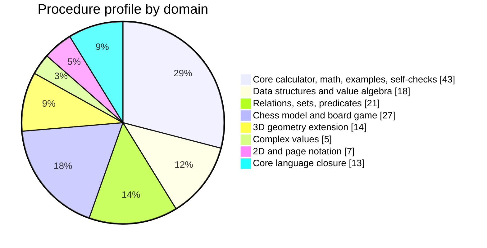
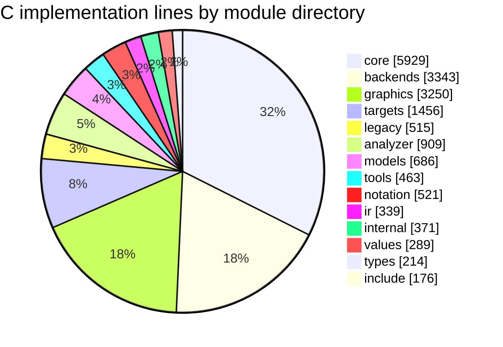
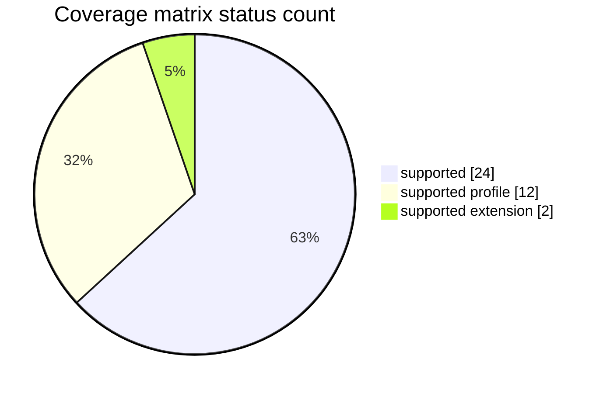
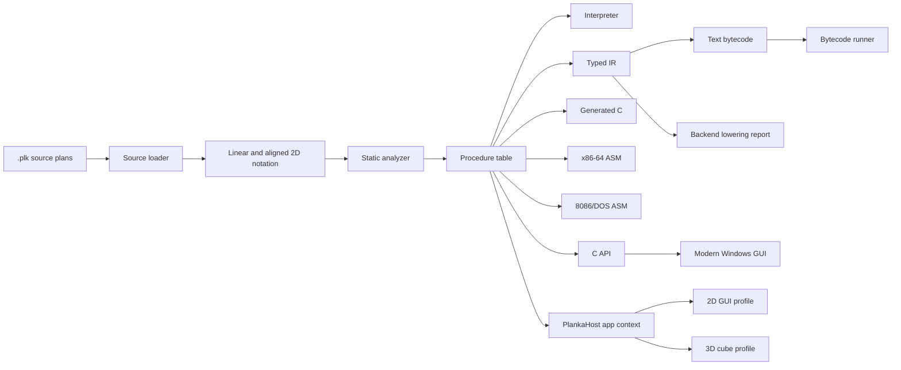
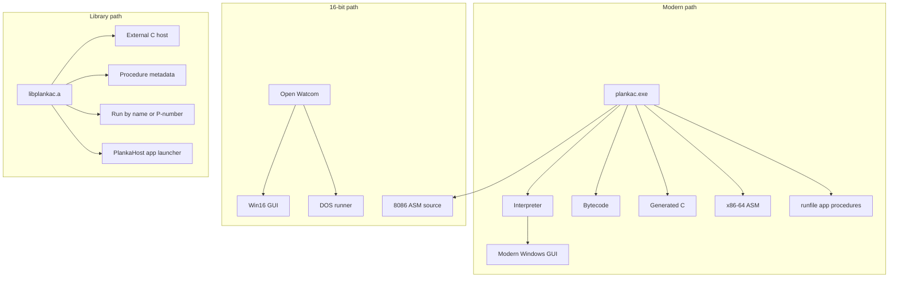
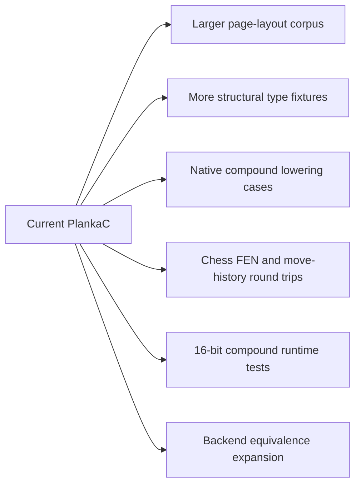

# PlankaC Infographic

This page is a compact engineering map of the repository. The numbers below
come from the current tree, not from a project pitch.

## Snapshot

| Metric | Value |
| --- | ---: |
| Loaded PlankaC source profile | 29 files |
| Repository `src/*.plk` files | 25 files |
| Graphics `.plk` profiles | 2 files |
| Loaded procedures | 148 procedures |
| C and graphics source/header modules | 45 files |
| Conformance fixture files | 33 files |
| Main host language | C89-oriented C |
| Main compiler artifacts | typed IR, bytecode, generated C, x86-64 ASM, 8086/DOS ASM |
| 16-bit targets | Win16 GUI, DOS runner |

## Procedure Mix



The calculator is the narrowest executable host, not the boundary of the
language work. The procedure profile is weighted toward data modeling,
relation algebra, typed value families, chess-domain structures, 3D geometry,
and backend/conformance checks.

## C Module Weight



The dominant implementation mass is concentrated in the expected subsystems:
loader/runtime logic in `c/core`, compiler-output logic in `c/backends`, and
host integrations in `graphics/c` and `c/targets`.

## Coverage Status



The coverage matrix is intentionally strict. `docs/plankalkuel_coverage.md`
is the contract: supported means there is source syntax, runtime behavior,
and test coverage.

## Toolchain



## Backend Map

| Output | Command | Artifact | Directness |
| --- | --- | --- | --- |
| Interpreter | `plankac run <proc>` | no generated file | direct execution of loaded `.plk` profile |
| Typed IR | `plankac ir out.ir` | readable `.ir` | statement-level typed compiler contract |
| Lowering report | `plankac lowering out.txt` | readable `.lowering` | backend plan for scalar and compound statements |
| Bytecode | `plankac bytecode out.pbc` | readable `.pbc` | compiler artifact, reloadable by PlankaC |
| Compiler pipeline | `plankac compile build/out` | `.pbc`, `.c`, `.S`, `_8086.asm` | source-to-IR-to-backends route |
| Generated C | `plankac cgen out.c` | C runner with embedded bytecode | portable host runner |
| x86-64 ASM | `plankac asmgen out.S` | native ASM runner | generated procedures plus helper runtime |
| Native C/ASM executables | `plankac native-c build/out`, `plankac native-asm build/out` | linked `.exe` | generated artifact linked by external GCC |
| 8086/DOS ASM | `plankac asm8086 out.asm` | MASM/TASM-style source | direct arithmetic procedures, bytecode image, compound heaps, and compound table |

## Backend Maturity

Scale: `5` means the path is practical for the current repository profile.
Lower values are useful, but intentionally narrower.

| Backend | Parser integrated | Compound values | Standalone artifact | 16-bit relevance | Current score |
| --- | ---: | ---: | ---: | ---: | --- |
| Interpreter | 5 | 5 | 1 | 1 | `##################` |
| Bytecode | 5 | 5 | 4 | 2 | `################` |
| Compiler pipeline | 5 | 5 | 5 | 3 | `#################` |
| Generated C | 5 | 5 | 4 | 2 | `################` |
| x86-64 ASM | 4 | 4 | 4 | 2 | `##############` |
| 8086/DOS ASM | 3 | 2 | 4 | 5 | `##############` |
| Win16/DOS compact hosts | 1 | 1 | 4 | 5 | `###########` |

## Execution Surfaces



## Language Basis And Engineering Decisions

| Area | Source basis | PlankaC engineering decision |
| --- | --- | --- |
| Plans / procedures | numbered plans | `P<number> name (...) => ... END` |
| Value rows | `V`, `C`, `Z`, `R` classes | direct runtime variable banks |
| Type rows | structure markers | parsed marker families with width and scale |
| 2D notation | expression row plus value/type rows | executable aligned `|`, `V|`, `S|` rows plus PAGE row/cell document validation |
| Chess examples | board and move modeling domain | executable board, legality, promotion, en passant, castling-path, stalemate, signature and attack-map procedures |
| 3D geometry | outside the documented core profile | explicit PlankaC extension |
| 8086 output | 16-bit execution target | separate DOS-oriented backend artifact |

## Verification Route

```text
build.bat
build\plankac.exe check
build\plankac.exe run calculator_demo
build\plankac.exe run relation_inverse_session
build\plankac.exe run chess_queen_attack_map_full_session
build\plankac.exe run three_d_pipeline_session
build\plankac.exe runfile graphics\src\plankagui.plk app_kind
build\plankac.exe runfile graphics\src\plankacube.plk app_kind
build\plankac.exe checkfile examples\max3.plk
build\plankac.exe runfile examples\max3.plk max3_demo
build\plankac.exe bytecode build\plankamath.pbc
build\plankac.exe ir build\plankac.ir
build\plankac.exe lowering build\plankac.lowering
build\plankac.exe cgen build\plankac_generated.c
build\plankac.exe asmgen build\plankac_asm_runtime.S
build\plankac.exe asm8086 build\plankac_8086.asm
build\plankac_conformance.exe
```

Expected high-level result:

```text
PlankaC OK: 29 files, 148 procedures
PlankaC file OK: 30 files, 151 procedures
R0=9
Bytecode OK: 148 procedures
IR written: build\plankac.ir
Lowering written: build\plankac.lowering
8086 ASM written: build\plankac_8086.asm
CONFORMANCE OK
```

## Further Hardening Targets



The engineering rule is concrete: every language feature should have source
examples, runtime behavior, documentation, and conformance coverage.
